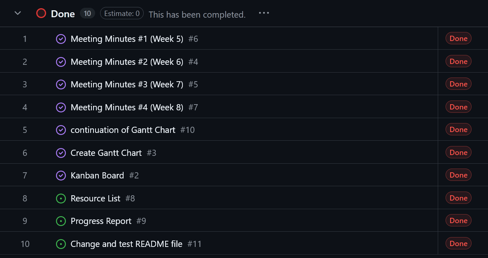
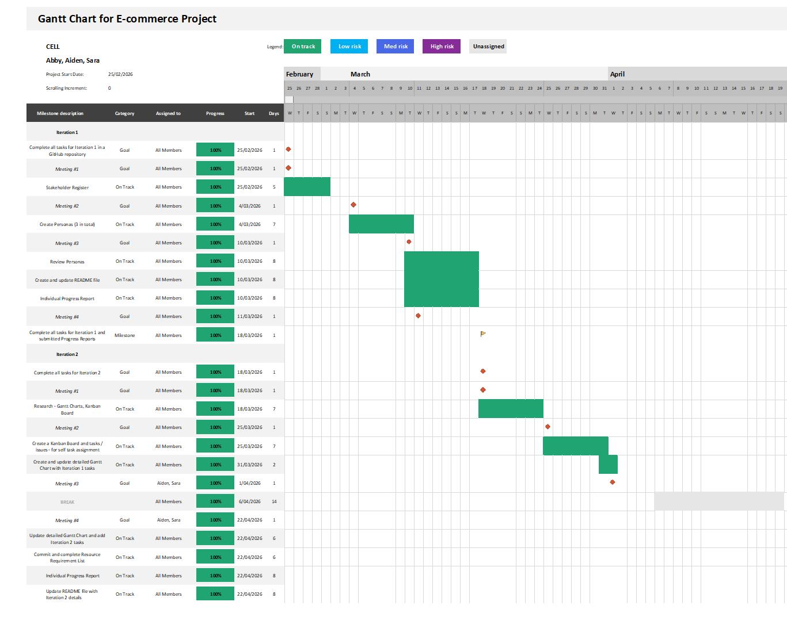
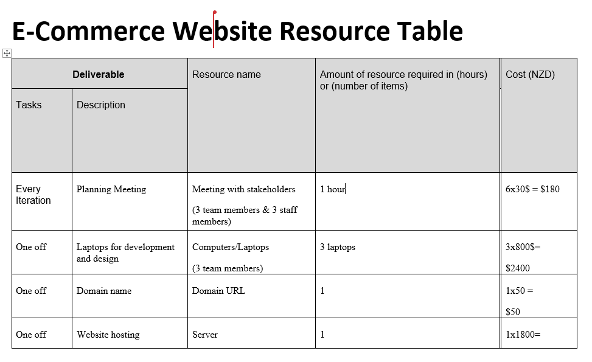
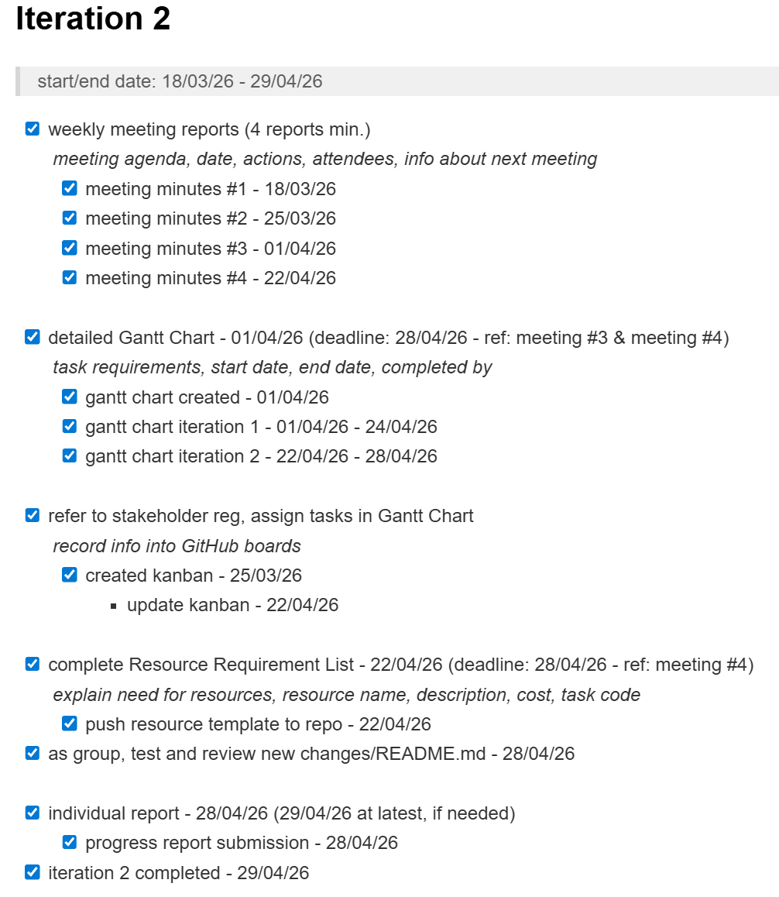

# Iteration 1 

> Group: Cell (Abby @abbyabbyabby12, Aiden @aidenscattergood, Sara @sellws2)

---

Agenda: plan and control a software development project (e-commerce), with supporting documentation.
 

For Iteration 1 we have completed the 
following deliverables:

#### Checklist
- [x] Must be contained and managed in a GitHub Repository.
- [x] Meetings (4 total, 1 for each week)
- [x] Stakeholder Register
- [x] 3 Personas (1 each)
- [x] Review Personas as a group
- [x] README file
- [x] Progress Report (150 words min.)

---

#### Personas:
- Persona 1 (*Abby*) 

- Persona 2 (*Aiden*) 

- Persona 3 (*Sara*) 

---

#### Progress reports:

### Aiden
### Agile Projects Progress Report
#### Iteration 1 progress report 
During iteration 1, I created and contributed to the stakeholder register and I also participated in our weekly meetings. I also created and filled out a meeting report providing plans for future meetings and created a persona while also providing feedback on Abby’s persona. Our group worked well together. We assigned each other tasks and completed them all before their deadlines. Our group’s communication was clear and we discussed ideas effectively. However, I found that there was a slight lack of group communication outside of class, which was difficult. To improve and prepare for iteration 2, my group needs to be more efficient in communication within and outside of class. Our group has made really good progress, and we successfully completed the required deliverables for iteration 1. Overall, as a group we worked well together to complete each deliverable. For iteration 2 I’m confident we will work even better and address each struggle we had leaving iteration 1.

---

### Abby
Iteration 1 – Progress Report – Abby 
Iteration one, completed in 5-week timeframe. I contributed the Stakeholder register, 
Group Meeting Report #2, Group Meeting report #4, Persona #1, and Persona #3 review. 
The stakeholder register consists of three stakeholders, James Smith, Emily Brown and 
Michael Lee. These stakeholders hold the titles of Security Manager, IT Lead and Staff 
Member. They hold the roles of Project Sponsor, Technical Support and User. The 
Group Meeting report #2 consists of the agenda items: Discuss personas and delegate 
personas. This meeting was about the task for iteration one of creating three personas. 
Persona #1 was my persona, Lucy Williams, a 34-year-old Forensic Scientist, and a 
potetional user for our e-commerce website.  Persona #3 Review was a review of the 
persona Agnes Baker, a 59-year-old Senior Piano Teacher, and a potential user of our e
commerce website. Group Meeting Report #4 consists of the agenda items:  check 
documents, and ensure documents are finalized. This meeting was about finalizing and 
editing the documents for Iteration 1. What went well for iteration 1 was the personas 
and persona reviews because we could easily evenly split the tasks, so they were fair. 
We did one persona each and one review each. What we need to work on next time is 
understanding our tasks better and making sure we all do the same amount of work or 
make the tasks balanced for all three iterations. Collectively we have completed all the 
tasks/achievements for iteration 1. Some challenges I had was with Git itself and how 
to git pull and all the other tasks to do with git. 

---

### Sara

**Week #1** 

We decided from the first group meeting that we would take turns with writing the meeting minutes and delegating the actions that would need to be taken. We discussed as a group what kind of stakeholders and users would be on our stakeholder register as one person (Aiden) filled in the template we used.

**Week #2** 

In Week #2 we decided to create a persona each since we needed at least 3. The persona I contributed to, Persona #3; is an older lady who has many hobbies and challenges who could be a good target for our agile project e-commerce website. (Evidence above).

**Week #3** 

I contributed to writing the meeting minutes for Week #3. Delegated to review our personas and got one person to review another group members persona and uploaded our reviews to GitHub. I reviewed Aiden's persona (Persona #2).
We discussed and started our individual progress report. Also discussed our README file and what should be added to it.

**Week #4** 

For week #4 we had the majority of our work done, just uploading final information/documents and making minor changes to documents I worked on in our repository (namely; persona review). Added progress report to READme file, checklist, and minor syntax formatting.

**Feedback** 

I think we did good as a group, we could delegate what we needed to do and go away and do our part and our contribution was done by the next meeting. One thing I think we could do to improve as we move on to Iteration 2, is use a Kanban board to be more organised as we get more tasks needing to be completed/reviewed. Just relying on the meeting minutes was ok but we could use a better organisational/communication method.

---

# Iteration 2

For Iteration 2 we have completed the following deliverables:

#### Checklist

- [x] Weekly Meeting Reports (4 reports in total)
> meeting agenda, date, actions, attendees, info about next meeting
- [x] Detailed Gantt Chart
> task requirements, start date, end date, completed by
- [x] Refer to Stakeholder Register, assign tasks in Gantt Chart
> record info into GitHub boards (kanban)
- [x] Complete Resource Requirement List
- [x] As a group, test and review new changes/README.md
- [x] Individual Progress Reports

Kanban Board: used to organise our project better by self-assigning tasks that need to be completed. Here are our completed notes/issues for Iteration 2:

Gantt Chart: used to visually represent our project progress by recording task requirements and associated dates and timelines.

Resource Requirement List: used to plan the resources needed to develop our e-commerce project.

Detailed Checklist: this is a detailed checklist with all dates and deadlines recorded, in reference to our weekly meeting agendas.

